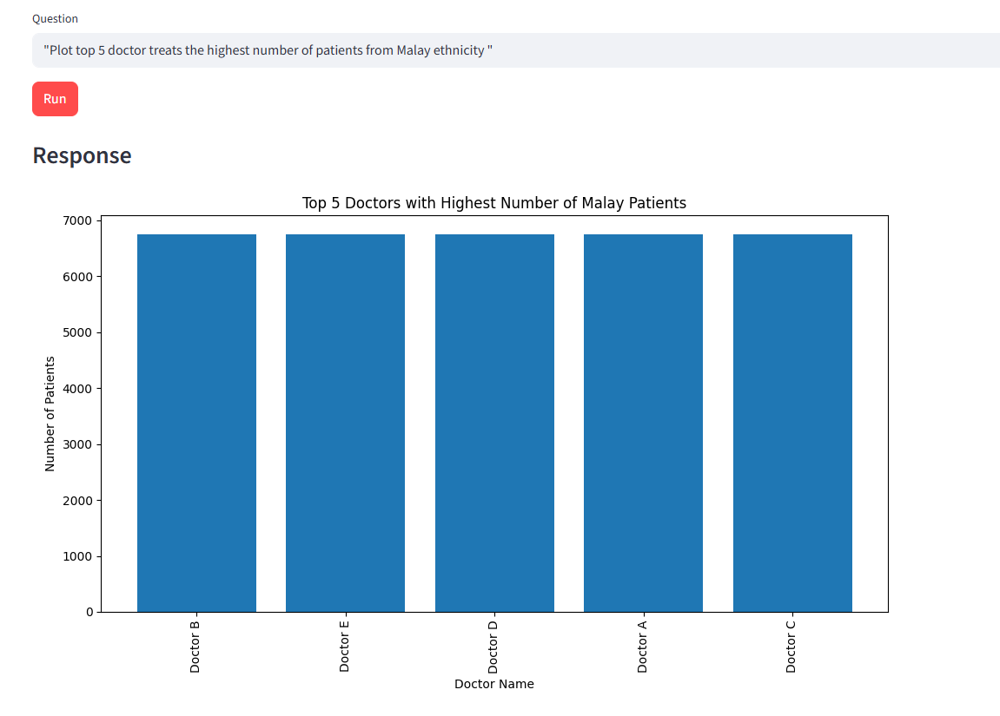
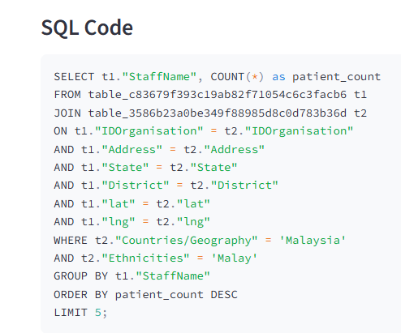
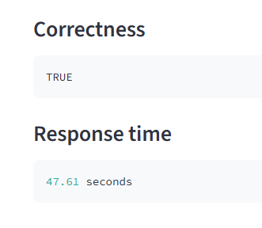
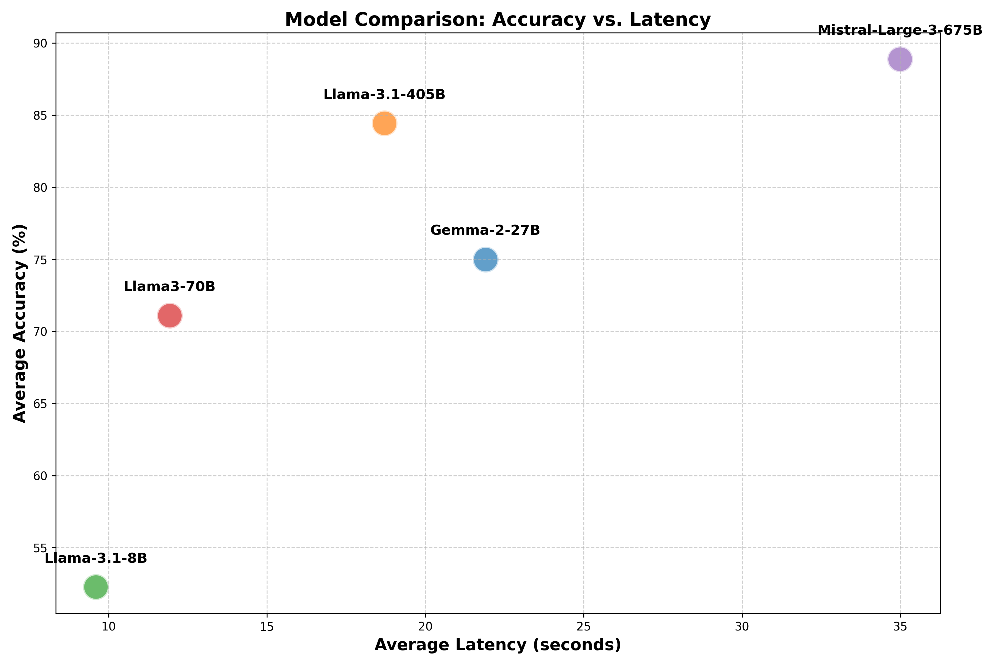
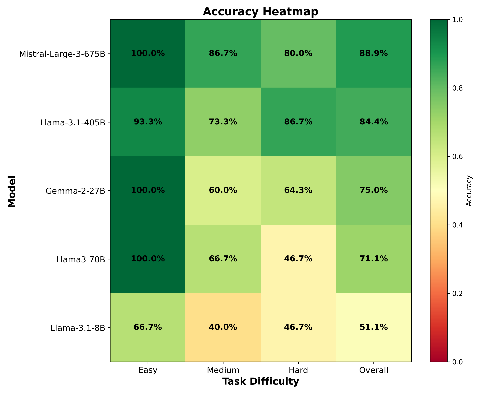

# Dynamic Dashboard using LLM

## Overview

This project is aimed at developing a dynamic dashboard utilizing Large Language Models (LLMs) to provide tailored data visualizations and interactions.

## Key Features
- **LLM-driven dashboard generation**: Automatically generate dashboards based on user input and data context.
- **Data ingestion**: Seamlessly ingest data from various sources for comprehensive analysis.
- **Visualization**: Create rich and interactive visual representations of data.
- **Prompt templates**: Use customizable prompt templates for different use cases.

## Tech Stack
- Frontend: [Streamlit]
- Framework: [Pandasai]


## Project Structure
```
project/
├── src/                    # Source files streamlit web page of Dynamic Dashboarding
├── dataset/                # dataset for experiment
├── export/                 # Pandasai Dashboard         
└── tests/                  # experiment test
```

## Setup Instructions
### Prerequisites
- [Insert prerequisites here]

### Installation
1. Clone the repository:
   ```bash
   git clone https://github.com/roysaw77/FYP-Dynamic-Dashboard-using-LLM.git
   cd FYP-Dynamic-Dashboard-using-LLM
   ```
2. Install dependencies:
   ```
   [streamlit,pandasai,pandasai_litellm,litellm]
   ```

### Environment Variables
- python version 3.11.9

## How to Run
### Start Commands
- [Streamlit run main.py]


## Function
- 

- 

- 

# Experiment test


